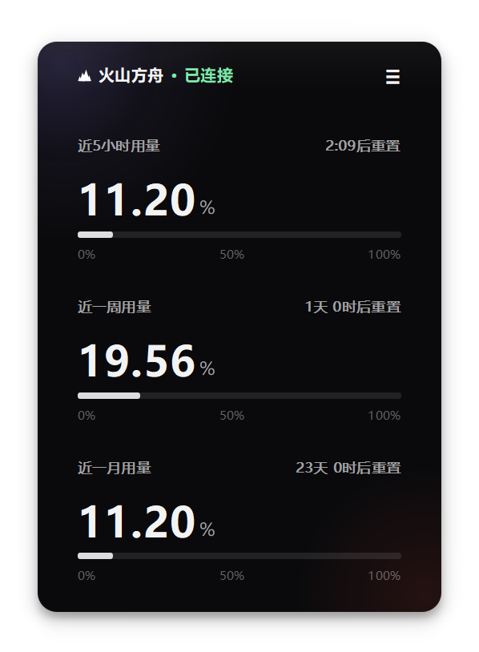

[](https://hzdavy.github.io/PlanMonitor/)

#  Plan Monitor

[](https://github.com/HZDavy/PlanMonitor/releases) [](LICENSE) [](https://github.com/HZDavy/PlanMonitor/releases/latest) [](https://github.com/HZDavy/PlanMonitor/releases/latest)    [](https://hzdavy.github.io/PlanMonitor/)

> 火山方舟 **Coding Plan / Agent Plan** 用量浮窗 · 挂在副屏,看着余额用完

一个轻量、不打扰的桌面小工具,实时监控火山方舟 Coding Plan / Agent Plan 个人版的额度用量,以「近 5 小时 / 近一周 / 近一月」三个时间窗口展示已用量、配额、剩余量与下次重置倒计时。

<p align="center">
  
</p>

---

## 特性

- **双 Plan 支持**:设置页一键切换 `Coding Plan` / `Agent Plan`,自动切换对应用量接口
  - Coding → `GetCodingPlanUsage`
  - Agent → `GetAFPUsage`(AFP 五小时 / 日 / 周 / 月额度)
- **多窗口监控**:已用量、配额、剩余量、剩余百分比、距下次重置倒计时
- **自动刷新**:默认每 30 秒拉取一次,也可手动刷新
- **副屏友好**:可置顶、一键移动到副屏,多屏 / 不同分辨率(DPI)间拖动自动防裁切,下次启动自动恢复位置
- **Deep 深色 UI**:长时间挂屏不刺眼,字体经字形适配
- **静默运行**:不抢焦点、托盘常驻、关闭即最小化到托盘;默认以工具窗口模式运行(不占用任务栏),需要时可通过菜单临时调出并固定到任务栏
- **私密安全**:AK/SK 仅保存在本地 `config.json`,除官方 OpenAPI 外无任何外发请求

---

## 支持厂商与路线图

> 当前版本**仅支持火山方舟**的 Coding Plan / Agent Plan。其他厂商会按“公开 API 完善度 + 接入稳定性”逐步评估和接入。

| 厂商 | 当前状态 | 原因与接入难度 |
|---|---|---|
| 火山方舟 | ✅ 已支持 | 官方 OpenAPI 直接返回账户级额度与用量，接口稳定 |
| 腾讯混元 TokenHub | 🚧 计划优先支持 | 提供 `DescribeModelQuota`、`ListUsage` 等官方 API，可查询模型配额与 token 用量，难度中等 |
| Azure OpenAI | ⏳ 后续评估 | Azure Management API 可查询订阅/部署级配额，响应头也含剩余速率，但缺少账户余额 API，难度中等偏高 |
| Google Gemini | ⏳ 后续评估 | Google Cloud Quotas API 可查询项目级配额（RPM/TPM/RPD），但无直接剩余额度 API，难度中等偏高 |
| 阿里云百炼 | ⏳ 后续评估 | 仅有模型级限额 API，缺少账户剩余额度 API，需控制台解析或本地估算，难度偏高 |
| 百度千帆 | ⏳ 后续评估 | 控制台有 Token Plan 用量统计，但公开 API 未提供剩余额度查询，需控制台解析，难度偏高 |
| 智谱 AI | ⏳ 后续评估 | 控制台有 Coding Plan 用量页面，但暂无账户级剩余额度的公开 API，需控制台解析，难度偏高 |
| DeepSeek | ⏳ 后续评估 | 仅有单次请求 `usage` 字段，控制台可导出 CSV，缺少账户级实时用量 API，难度偏高 |
| OpenAI | ⏳ 后续评估 | 仅有响应头 `x-ratelimit-remaining-*`，无账户余额/剩余额度 API，适合速率监控而非额度监控，难度高 |
| Anthropic Claude | ⏳ 后续评估 | 仅有响应头限额信息与控制台 spend cap，无账户级剩余额度 API，难度高 |
| Groq | ⏳ 后续评估 | 仅有响应头 `x-ratelimit-*`，无账户级累计用量/剩余额度 API，难度高 |

> 判断标准：优先接入“提供官方账户级用量/配额 API”的厂商；仅提供控制台页面、单次请求 `usage` 或响应头 rate-limit 的厂商，需要写页面解析、本地累计估算或降级为速率监控，稳定性和准确性都较差，因此放在后面考虑。

## 后续功能计划

- **更多厂商接入**：按上表顺序逐步支持腾讯混元、Azure OpenAI、Google Gemini 等公开 API 更完善的厂商；其余厂商会持续评估。
- **更多样式与自定义样式**：后续会提供可切换的 HUD 样式，包括类似“加速球”的交互形态——平时收缩为屏幕边缘的悬浮小球，点击后展开完整浮窗；支持吸附在屏幕四边、自定义透明度、尺寸、圆角和主题色，让不同场景下都能轻便常驻。

---

## 快速开始

### 方式一:直接运行可执行文件

从 [Releases](https://github.com/HZDavy/PlanMonitor/releases) 下载最新 `PlanMonitor.exe`(Windows 10/11 x64),双击运行。

### 方式二:Python 源码

环境要求:Python 3.8+

```bash
pip install PyQt5 requests
python coding_plan_monitor.py
```

---

## 配置 Access Key

1. 打开火山引擎控制台 **Access Key 管理**
2. 创建一个 Access Key(推荐使用子账号 AK,仅授予 `ArkReadOnlyAccess` 权限)
3. 首次启动后点击托盘/菜单 **设置**,填入:
   - **Access Key ID**
   - **Secret Access Key**
   - **(可选)Region**,默认 `cn-beijing`
4. 保存后自动请求一次并刷新界面

> 在应用内菜单可一键打开**用量订阅页**与 **Access Key 管理页**,免去手动记 URL。

---

## 使用方法

1. 将窗口拖到副屏合适位置
2. 点击底部 **置顶**,窗口保持在所有窗口最前
3. 点击底部 **→ 副屏**,窗口立即移到第一个外接屏幕
4. 设置页切换 **Plan** 后,用量查询与订阅页跳转会自动跟随

---

## 数据与鉴权

- 数据源:火山方舟 OpenAPI `GetAFPUsage`(`Action=GetAFPUsage&Version=2024-01-01`)
- 鉴权:火山引擎 `HMAC-SHA256` V4 签名,按官方规范生成 `StringToSign`,实现见 `sign_request`
- 本地代理日志便于排障(可关闭)

---

## 项目结构

```
coding_plan_monitor.py    # 主程序(单文件,可直接分发)
config.json               # 首次保存凭据后自动生成(勿提交到仓库)
```

---

## 常见问题

**窗口找不到 / 最小化后消失?** 程序默认驻留托盘(系统托盘图标),点击图标或使用系统托盘菜单恢复。

**任务栏上为什么没有图标?** 程序默认以工具窗口模式(`Qt.Tool`)运行,不占用任务栏。若想让它在任务栏固定一个图标,点击托盘菜单 **固定到任务栏**,窗口会临时出现在任务栏,按提示手动固定后点「确定」即恢复工具窗口模式。

**切到 Agent Plan 后无数据显示?** 请确认该账号已开通 Agent Plan 个人版,并在火山引擎控制台确认套餐额度可用。

**想要开机自启 / 多屏位置记忆?** 窗口会自动记忆上次位置;如需开机自启,将 `PlanMonitor.exe` 快捷方式放入启动文件夹即可。

---

## 构建(可选)

```bash
pyinstaller --noconfirm --clean PlanMonitor.spec
```

产物位于 `dist/PlanMonitor.exe`。

---

## License

本项目采用 [GNU AGPL-3.0](./LICENSE) 许可证开源。